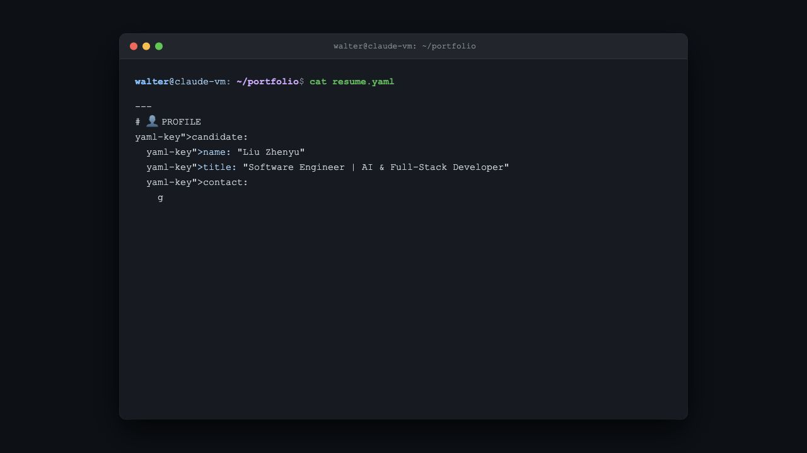

# WalterCQ.github.io

Static GitHub Pages portfolio rendered as a terminal-style resume.

## Screenshot



## Files

- `index.html`: complete page, styles, and typewriter resume data

## Run Locally

Open `index.html` in a browser, or serve the folder:

```bash
python3 -m http.server 8000
```

Then visit `http://localhost:8000`.
